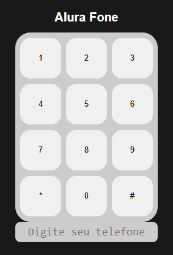

# Alurafone

<div style="text-align: center;">



</div>

Este repositório contém um teclado numérico similar ao de um telefone. Com esta aplicação, você pode adicionar qualquer número de telefone em um visor.

## Funcionalidades

Adição de números: Adicione cada número de seu telefone com um clique no mouse ou pressione a tecla TAB até o seletor se posicionar sobre o número desejado, então aperte as teclas BARRA ou ENTER.

## Tecnologias Utilizadas - Tools
- HTML/CSS: Para a estrutura e estilo da aplicação.

- JavaScript: Para a lógica e interatividade do programa.

## How Contribute

```bash
# Clone the project
$ git clone https://github.com/bhclira/alurafone
```

### License

This project is under the MIT license. See the file [License](LICENSE) for more details